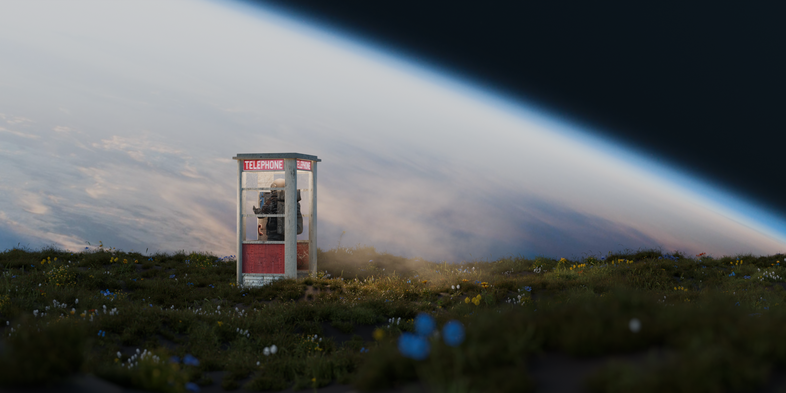

# Space-Telephone-Booth-Blender-

A rendering practice using blender.

# 制作信息
版本: 5.1.1
渲染引擎: Cycles
最大采样: 4096
使用插件: Geo-Scatter

# 教程来源
[Link](https://www.bilibili.com/video/BV1qn4y1o7W7?spm_id_from=333.788.videopod.sections&vd_source=0044fa2ba003133bf9c4cfd414f29bf3)

# Notes
- 使用Geo-Scatter及其内置资产完成花草地的散布
- 用贴图及颜色渐变处理玻璃材质，而非调整IOR以优化性能
- 通过噪波纹理，层权重等节点模拟雾状光影